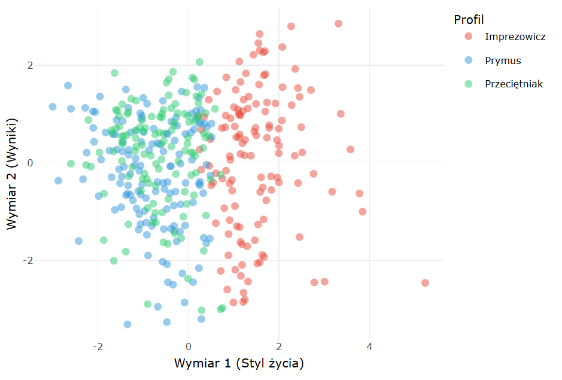
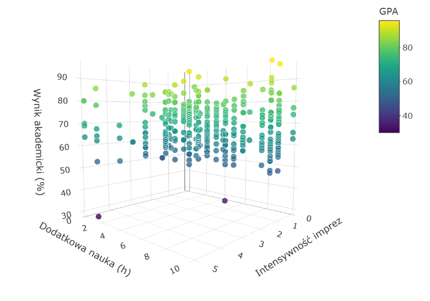
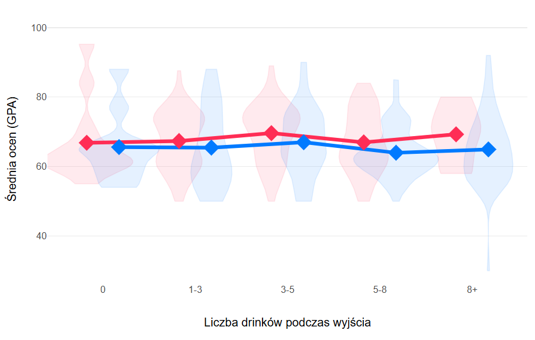

# 🍺 Alcohol & Cognitive Performance in University Students
> A Multidimensional Statistical Analysis of Lifestyle, Economics and Academic Outcomes.

## 📌 Przegląd projektu
Ten projekt analizuje wpływ spożycia alkoholu oraz czynników socjoekonomicznych na wyniki w nauce (GPA) studentów. Analiza wykracza poza proste korelacje, badając efekty kompensacji (nauka vs imprezy), wpływ miejsca zamieszkania oraz rolę aprobaty rodziców.

### 🔍 Kluczowe pytania badawcze
* Czy istnieje mierzalny wpływ alkoholu na GPA? (Spoiler: Jest słabszy niż myślisz!)
* Czy wyższy budżet ("allowance") bezpośrednio promuje ryzykowny styl życia?
* Czy dodatkowe godziny nauki są w stanie "uratować" oceny przy intensywnym imprezowaniu?

---

## 🛠 Metodologia
Projekt został zrealizowany w języku **R** przy użyciu nowoczesnego ekosystemu bibliotek:
* **Data Wrangling:** `tidyverse`, `dplyr`, `validate`
* **Braki danych:** Imputacja metodą **k-Nearest Neighbors (kNN)** przy użyciu pakietu `VIM`.
* **Wizualizacja:** `ggplot2`, `plotly` (interaktywne wykresy 3D), `ggdist` (Raincloud plots).
* **Modelowanie:** Regresja logistyczna (`MASS`), testy nieparametryczne, analiza głównych składowych (**PCA**).

---

## 📊 Wybrane wizualizacje

### 1. Archetypy Studentów (PCA)
Dzięki analizie skupień wyodrębniono 3 główne profile studentów: **Prymus**, **Przeciętniak** oraz **Imprezowicz**.

  

### 2. Model Kompensacji (3D)
Interaktywna wizualizacja pokazująca, jak nakład nauki i intensywność imprezowania wspólnie kształtują wynik GPA.

  

### 3. Raincloud Plot (Gender Gap)
Szczegółowa analiza rozkładu ocen w zależności od płci i intensywności spożycia.

  

---

## 💡 Kluczowe spostrzeżenia
* **Korelacja Spearmana ($\rho = -0.086$):** Wpływ alkoholu na oceny jest statystycznie istotny, ale wyjaśnia mniej niż 1% zmienności wyników.
* **Efekt Akademika:** Studenci mieszkający w akademikach przy wysokim spożyciu wykazują o **23% wyższe ryzyko** dużej absencji niż studenci w mieszkaniach prywatnych.
* **Paradoks Imprezowicza:** Zgodnie z modelem logitowym, umiarkowane życie towarzyskie może obniżać ryzyko porażki (OR < 1.0), o ile nie prowadzi do opuszczania zajęć.

---

## 🚀 Jak włączyć?
1. Sklonuj repozytorium: `git clone https://github.com/TwojUser/TwojeRepo.git`
2. Otwórz projekt w **RStudio**.
3. Upewnij się, że masz zainstalowany pakiet `pacman` lub zainstaluj biblioteki wymienione w sekcji `pakiety` w pliku .Rmd.
4. Wygeneruj raport: Kliknij przycisk **Knit** (do HTML).

---

## 👥 Authors
* **Oskar Iwaszkiewicz**
* **Bartłomiej Duda**
* **Kajetan Bernat**
* **Olga Dawidowicz**

---
*Projekt zrealizowany w ramach zajęć Analizy Danych.*